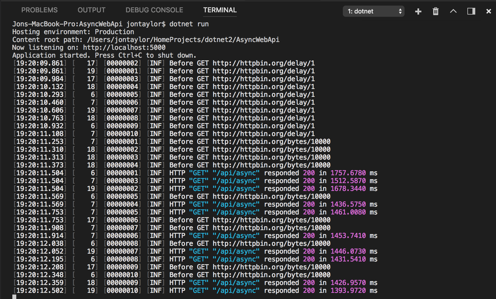

# Description

This repo contains a little C# ASP.NET Core application with a single Web API endpoint:

* GET /api/async

When invoked, the action method performs a couple of async operations:

* GET http://httpbin.org/delay/1
* GET http://httpbin.org/bytes/10000

Finally, it returns the number of bytes in the response of the second async operation.

The idea is to observe web server threads handling multiple overlapped requests. To help see this, I have added some logging. I use a middleware class to increment a RequestId for each request received. This is made available to the Serilog LogContext (3rd column). The Serilog logging also includes the thread id (2nd column).

# TODO

* Use [Gatling](https://gatling.io/) to send a big bunch of load to the endpoint.

# Links

* [HTTP Request & Response Service](http://httpbin.org)
* [Enriching Serilog Output with HttpContext Information in ASP.NET Core v1.0](http://mylifeforthecode.com/enriching-serilog-output-with-httpcontext-information-in-asp-net-core/)
